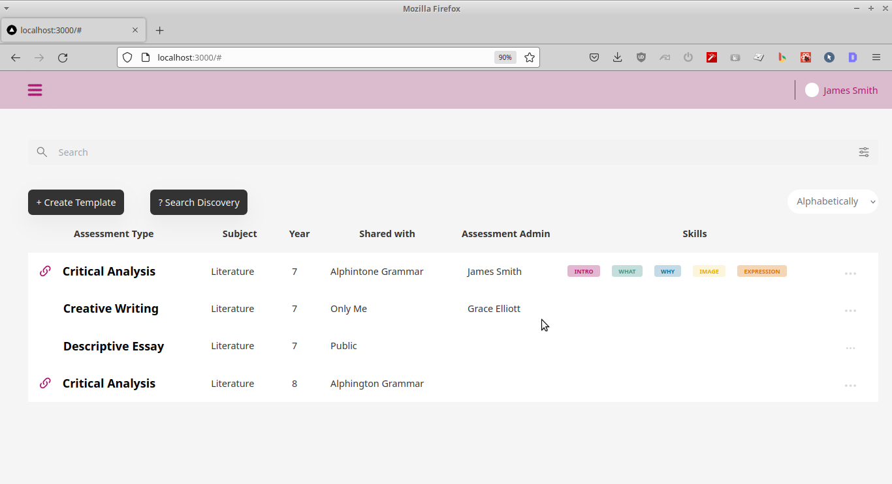

## Sample Single Page for James Smith's Trial Task

### Tech Stack

Next.js, Tailwind CSS with JavaScript.

### Features Working

1. Search Bar
2. Filter
3. Duplicate Entry
4. Delete Entry
5. Create Template

### Features Not Working

1. Edit
2. View History Template
3. Search Discovery--> It searches every entry on search Menu Input

### Issues

1. As Time was less, i am unable to make the table body design as per figma file. I tried to make it as close as possible.
2. I tried to not to cross 5 hours mark because these features need bit more time to implement from my side.
